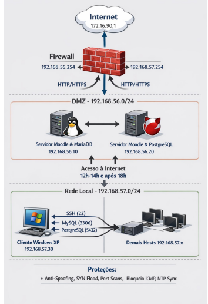

# 🛡️ Laboratório de Firewall: IPTables e IPFW

Atividade profissional e avançada demonstrando a criação de regras de mitigação, proteção de infraestrutura (Stateful Inspection), Network Address Translation (NAT) e logging isolado de pacotes em dois sistemas distintos.



## 📋 Topologia da Rede
*   **Servidor Firewall:**
    *   WAN (`172.16.90.1`) - Interface de conexão Externa/Internet.
    *   DMZ (`192.168.56.254`) - Gateway da Rede Desmilitarizada.
    *   LAN (`192.168.57.254`) - Gateway da Rede Local de Clientes.
*   **Servidores DMZ (192.168.56.0/24):**
    *   Joomla 5 (Web): `192.168.56.10`
    *   PostgreSQL/MySQL: `192.168.56.20`
*   **Clientes LAN (192.168.57.0/24):**
    *   Administrador Windows: `192.168.57.30`

## ⚙️ Regras Aplicadas (Exigência do Projeto)
- **Política Rígida (DROP)** em todos os fluxos.
- **NAT:** Exposição das portas 80 e 443 do servidor web para a Internet via DNAT.
- **Bloqueio Subjacente:** Recusa automática de ICMP externo, Flags TCP incompletas (State tracking), Anti-Scan e port-forward bloqueado para serviços internos críticos (MySQL/SSH).
- **Controle de Horários:** Clientes LAN têm tráfego restrito de acesso externo para horário de almoço e noite.
- **Log Específico:** Interceptação visual da porta de DBs e SSH para o usuário ADM Windows.

---

## 🚀 1. Utilizando o IPTables (Debian Linux 13.x)

O script Linux `firewall_iptables.sh` deve ser executado no boot da sua VM de roteador/gateway.

```bash
chmod +x firewall_iptables.sh
sudo ./firewall_iptables.sh
```

**Principais verificações no Linux:**
```bash
# Ver as regras de filtro
iptables -L -v -n

# Ver as regras de NAT (Port forwarding)
iptables -t nat -L -v -n

# Acompanhar os blocos e acessos do usuario ADM ao vivo:
tail -f /var/log/kern.log | grep FW-WIN_ACCESS_ACCEPT
```

---

## 🚀 2. Utilizando o IPFW (FreeBSD 15.x)

Para utilizar o firewall BSD `firewall_ipfw.sh`, é necessário autorizá-lo a comandar as políticas do kernel:

1. Acesse o sistema e modifique o `/etc/rc.conf`:
   ```bash
   firewall_enable="YES"
   firewall_script="/etc/firewall_ipfw.sh"
   gateway_enable="YES"
   natd_enable="YES"
   ```
2. Adicione e dê permissão para o script:
   ```bash
   chmod +x firewall_ipfw.sh
   sh firewall_ipfw.sh
   ```

**Verificando as regras em runtime no BSD:**
```bash
ipfw show
```

---

## 🧪 3. Prova de Funcionamento (Auditoria com Python)

Para documentar os acessos restritos, utilizamos o `test_firewall.py`. Este script foi escrito em puro Python (sem necessidade de pacotes externos, compatível com Python 3 em qualquer sistema).

> **Atenção:** Deve ser executado em uma **Máquina Externa** conectada fisicamente ou via adaptador host-only para a rede associada à WAN do Firewall (`172...`).

### Como Executar
```bash
python3 test_firewall.py
```

### O que acontece sob o capô?
1. Efetua um pulso `ICMP Request` (Ping): Falha esperada pois o Firewall descarta na Chain de Input externa.
2. Abre sockets de teste em portas permitidas (80, 443): Sucesso esperado (Redirecionamento para Joomla funcionando por DMZ).
3. Abre sockets críticos de acesso administrativo (22, 3306, 5432): Timeout garantido pela premissa `DEFAULT DROP`.
4. Os relatórios de segurança auditados em tela são simultaneamente injetados com datestamping no arquivo local de logs `relatorio_seguranca_YYYYMMDD.log`.
