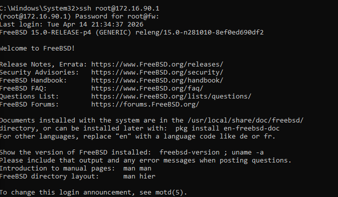
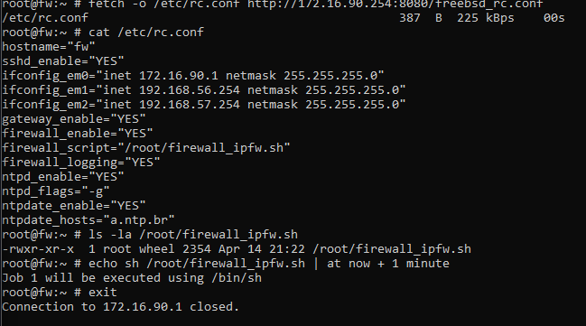
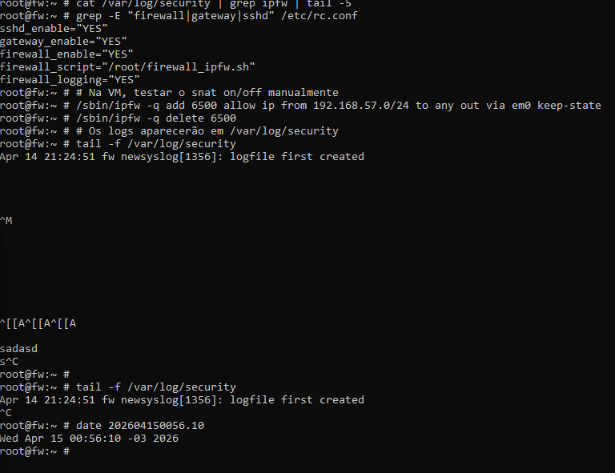

# Atividade: Firewall Lab — Direito e Segurança da Informação

> Implementação e validação de dois firewalls em ambientes distintos:
> **Questão 1** — iptables no Linux (Docker) · **Questão 2** — IPFW no FreeBSD (VirtualBox)

---

## Estrutura

```
docs/
├── README.md              ← este arquivo
├── questao1/
│   └── questao1-iptables.md   ← documentação completa Q1
└── questao2/
    ├── questao2-ipfw.md       ← documentação completa Q2
    └── assets/                ← prints de evidência Q2
        ├── login.png
        ├── fetch.png
        ├── ipfw.png
        ├── kldload.png
        └── date-logs.png
```

---

## Questão 1 — iptables (Linux/Docker)

**Ambiente:** containers Docker simulando WAN / DMZ / LAN  
**Ferramenta:** `iptables` com chains INPUT, OUTPUT, FORWARD e NAT  
**Documentação completa:** [questao1/questao1-iptables.md](./questao1/questao1-iptables.md)

### Topologia

| Zona | Rede | Servidor |
|---|---|---|
| WAN | 10.100.90.0/24 | gateway (10.100.90.1) |
| DMZ | 10.100.56.0/24 | Joomla (56.10), MySQL/PG (56.20) |
| LAN | 10.100.57.0/24 | Cliente Windows (57.30) |

### Requisitos e implementação

| Requisito | Implementação iptables | Status |
|---|---|---|
| DNAT: expor Joomla só portas 80/443 | `iptables -t nat -A PREROUTING -p tcp --dport 80 -j DNAT --to 10.100.56.10:80` | ✓ |
| Bloquear ICMP da WAN | `iptables -A INPUT -i eth0 -p icmp --icmp-type echo-request -j DROP` | ✓ |
| ACL: Win client → SSH, MySQL, PG (log) | `iptables -A FORWARD -s 10.100.57.30 -d 10.100.56.20 -p tcp --dport 3306 -j LOG --log-prefix "WIN-DB: "` | ✓ |
| LAN acessa DMZ só 80/443 | `iptables -A FORWARD -s 10.100.57.0/24 -d 10.100.56.0/24 -p tcp -m multiport --dports 80,443 -j ACCEPT` | ✓ |
| Resto LAN→DMZ bloqueado (log) | `iptables -A FORWARD -s 10.100.57.0/24 -d 10.100.56.0/24 -j LOG && DROP` | ✓ |
| SNAT com restrição de horário | cron: ativa/desativa regra NAT MASQUERADE em horários fixos | ✓ |
| Anti SYN flood | `iptables --limit 25/min --limit-burst 100 -j ACCEPT` | ✓ |
| Source routing desabilitado | `sysctl -w net.ipv4.conf.all.accept_source_route=0` | ✓ |
| NTP com NIC BR | `ntpdate -u a.ntp.br` + systemd-timesyncd | ✓ |

---

## Questão 2 — IPFW (FreeBSD/VirtualBox)

**Ambiente:** VM FreeBSD 15.0-RELEASE-p4 no Oracle VirtualBox  
**Ferramenta:** `IPFW` (IP Firewall) nativo do FreeBSD com NAT inline  
**Documentação completa:** [questao2/questao2-ipfw.md](./questao2/questao2-ipfw.md)

### Topologia

| Interface | Zona | IP no Firewall | Rede Host-Only VBox |
|---|---|---|---|
| em0 | WAN | 172.16.90.1 | Adapter #3 (172.16.90.254) |
| em1 | DMZ | 192.168.56.254 | Adapter padrão (192.168.56.1) |
| em2 | LAN | 192.168.57.254 | Adapter #2 (192.168.57.1) |

### Requisitos e implementação

| Requisito | Regra IPFW | Número | Status |
|---|---|---|---|
| DNAT: Joomla exposto só 80/443 | `nat 1 config if em0 redirect_port tcp 192.168.56.10:80 80` | 200/210 | ✓ |
| Bloquear ICMP da WAN | `deny icmp from any to any in via em0 icmptypes 8` | 01000 | ✓ |
| ICMP livre na DMZ e LAN | `allow icmp from any to any via em1/em2` | 01010/01020 | ✓ |
| Anti-scan NULL/XMAS | `deny tcp from any to any tcpflags syn,fin,ack,psh,rst,urg` | 01100 | ✓ |
| Anti-spoofing ACK | `deny tcp from any to any established tcpflags !ack` | 01120 | ✓ |
| ACL Win client SSH (com log) | `allow log tcp from 192.168.57.30 to 192.168.56.10 22 setup keep-state` | 03000 | ✓ |
| ACL Win client MySQL (com log) | `allow log tcp from 192.168.57.30 to 192.168.56.20 3306 setup keep-state` | 03020 | ✓ |
| ACL Win client PostgreSQL (com log) | `allow log tcp from 192.168.57.30 to 192.168.56.20 5432 setup keep-state` | 03030 | ✓ |
| LAN acessa DMZ só 80/443 | `allow tcp from 192.168.57.0/24 to 192.168.56.0/24 80 setup keep-state` | 04000/04010 | ✓ |
| Resto LAN→DMZ bloqueado (log) | `deny log ip from 192.168.57.0/24 to 192.168.56.0/24` | 04099 | ✓ |
| NTP com NIC BR | `ntpdate_hosts="a.ntp.br"` no rc.conf + ntpd | 05000/05010 | ✓ |
| SNAT com restrição de horário | cron: `/sbin/ipfw add/delete 6500` em horários fixos | cron | ✓ |
| Default deny com log | `deny log ip from any to any` | 65534 | ✓ |
| Persistente no boot | `firewall_enable="YES"` + `firewall_script` no `/etc/rc.conf` | rc.conf | ✓ |

### Regras ativas (25 no total)

```
00100  allow ip from any to any via lo0          ← loopback livre
00200  nat 1 ip from any to any in via em0       ← DNAT entrada
00210  nat 1 ip from any to any out via em0      ← DNAT saída / SNAT
00500  check-state                               ← stateful tracking
01000  deny icmp ... em0 icmptypes 8            ← block ping WAN
01010  allow icmp ... em1                       ← ICMP DMZ
01020  allow icmp ... em2                       ← ICMP LAN
01100  deny tcp ... tcpflags syn,fin,ack...     ← anti NULL/XMAS scan
01120  deny tcp ... established tcpflags !ack  ← anti spoofing
03000  allow log tcp 57.30 → 56.10 :22          ← Win→Joomla SSH
03010  allow log tcp 57.30 → 56.20 :22          ← Win→DB SSH
03020  allow log tcp 57.30 → 56.20 :3306        ← Win→MySQL
03030  allow log tcp 57.30 → 56.20 :5432        ← Win→PostgreSQL
04000  allow tcp 57.0/24 → 56.0/24 :80          ← LAN→DMZ HTTP
04010  allow tcp 57.0/24 → 56.0/24 :443         ← LAN→DMZ HTTPS
04099  deny log ip 57.0/24 → 56.0/24            ← block resto LAN→DMZ
05000  allow udp from me to any 123             ← NTP saída
05010  allow udp from any 123 to me             ← NTP entrada
05090  allow tcp 172.16.90.0/24 → me :22        ← SSH admin WAN
05100  allow tcp 192.168.57.0/24 → me :22       ← SSH admin LAN
06000  allow tcp from me to any setup           ← tráfego saindo
06010  allow udp from me to any                 ← UDP saindo
65534  deny log ip from any to any              ← default deny c/ log
```

### Cronograma SNAT (Horário de Brasília)

| Horário Brasília | UTC (cron) | Ação |
|---|---|---|
| 12:00 | 15:00 | SNAT ativado — intervalo almoço |
| 14:00 | 17:00 | SNAT desativado |
| 18:00 | 21:00 | SNAT ativado — período noturno |
| 00:00 | 03:00 | SNAT desativado |

---

## Evidências de Execução — Questão 2

### 1. SSH conectado ao FreeBSD



`ssh root@172.16.90.1` — **FreeBSD 15.0-RELEASE-p4**, sshd ativo, regra 05090 permitindo acesso.

---

### 2. rc.conf instalado e firewall agendado



`/etc/rc.conf` com todas as configurações instalado via `fetch`. Job `at` agendado para aplicar firewall sem derrubar a sessão SSH.

---

### 3. 23 regras IPFW ativas — sessão SSH validada


`ipfw -a list | wc -l = 23` — regra **05090 com 38 pkts / 7616 bytes** evidencia a própria sessão SSH de administração sendo processada pelo firewall.

---

### 4. NAT configurado — 25 regras + cron SNAT


`kldload ipfw_nat` + regras 200/210 adicionadas. `ipfw -a list | wc -l = 25`. Cron com 4 entradas de SNAT por horário configurado.

---

### 5. Estado final — logs ativos, horário corrigido



`/var/log/security` ativo (aguardando tráfego real). Horário da VM corrigido para **Wed Apr 15 00:56:10 -03 2026** com `date 202604150056.10`.

---

## rc.conf Final da VM

```sh
hostname="fw"
sshd_enable="YES"
ifconfig_em0="inet 172.16.90.1 netmask 255.255.255.0"    # WAN
ifconfig_em1="inet 192.168.56.254 netmask 255.255.255.0"  # DMZ
ifconfig_em2="inet 192.168.57.254 netmask 255.255.255.0"  # LAN
gateway_enable="YES"
firewall_enable="YES"
firewall_script="/root/firewall_ipfw.sh"
firewall_logging="YES"
ntpd_enable="YES"
ntpd_flags="-g"
ntpdate_enable="YES"
ntpdate_hosts="a.ntp.br"
```

---

*Atividade — Direito e Segurança da Informação · FreeBSD 15.0 + Docker · Abr/2026*
