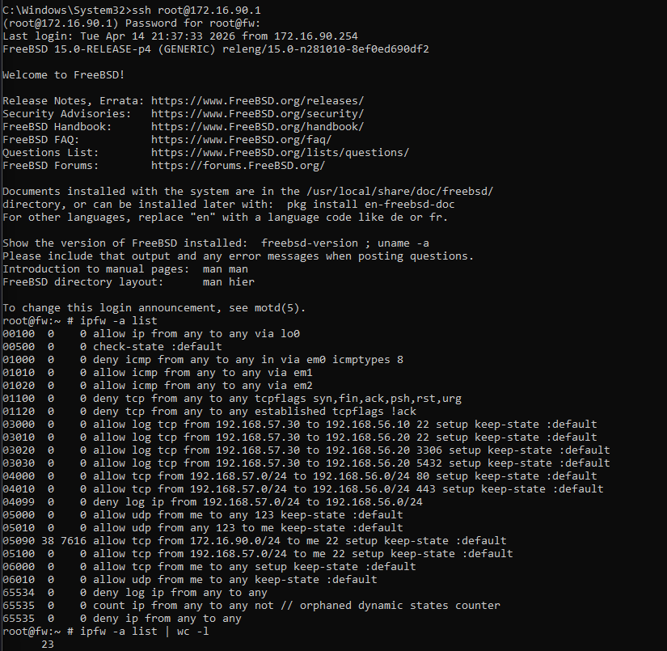
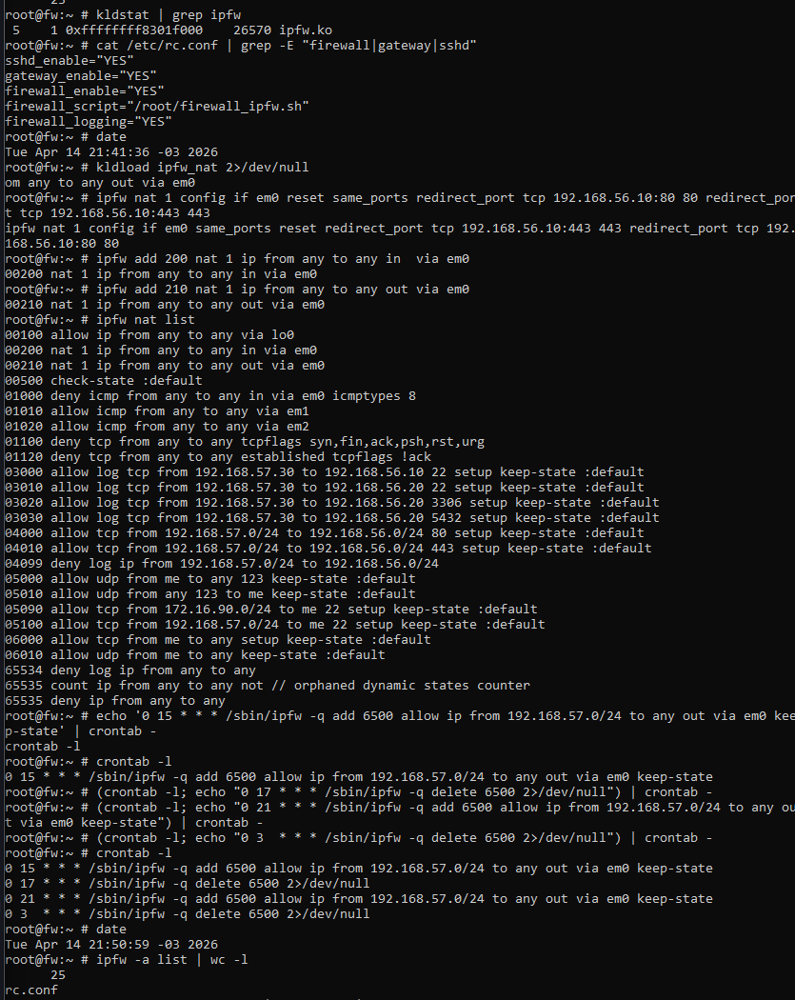

# Questao 2 — Implementacao de Firewall com IPFW no FreeBSD 15.x

## Documentacao Tecnica Detalhada

Disciplina: Direito e Seguranca da Informacao
Atividade: Politica de Firewall com IPFW no FreeBSD 15.x

---

## Sumario

0. [Situacao Real: Corrigir a VM Fw_Ipfw Existente](#0-situacao-real-corrigir-a-vm-fw_ipfw-existente)
   - [0.1 Problema encontrado](#01-problema-encontrado)
   - [0.2 Correcao pelo VirtualBox](#02-correcao-pela-interface-do-virtualbox)
   - [0.3 Diagnostico inicial dentro do FreeBSD](#03-diagnostico-inicial-dentro-da-vm-freebsd)
1. [Criar a VM com VBoxManage (PowerShell)](#1-criar-a-vm-com-vboxmanage-powershell)
2. [Instalar o FreeBSD 15.x](#2-instalar-o-freebsd-15x)
3. [Configurar a rede dentro do FreeBSD](#3-configurar-a-rede-dentro-do-freebsd)
4. [Instalar os pacotes necessarios](#4-instalar-os-pacotes-necessarios)
5. [Configurar o NTP com servidores NIC BR](#5-configurar-o-ntp-com-servidores-nic-br)
6. [Transferir o script firewall_ipfw.sh para a VM](#6-transferir-o-script-firewall_ipfwsh-para-a-vm)
7. [Habilitar o IPFW no boot](#7-habilitar-o-ipfw-no-boot)
8. [Aplicar o firewall e verificar as regras](#8-aplicar-o-firewall-e-verificar-as-regras)
9. [Configurar o SNAT por horario via cron](#9-configurar-o-snat-por-horario-via-cron)
10. [Testes completos dentro da VM](#10-testes-completos-dentro-da-vm)
11. [Resultados esperados por requisito](#11-resultados-esperados-por-requisito)

---

## 0. Situacao Real: Corrigir a VM Fw_Ipfw Existente

Esta secao documenta o que foi feito no laboratorio real com a VM ja existente no VirtualBox, antes de partir para a configuracao interna do FreeBSD.

### 0.1. Problema Encontrado

Ao tentar iniciar a VM `Fw_Ipfw`, o VirtualBox exibiu o seguinte erro:

```
VirtualBox - Erro
Nao foi possivel iniciar a maquina Fw_Ipfw pois as seguintes interfaces fisicas
de rede nao foram encontradas:

  enp6s0 (adapter 1), enp6s0 (adapter 2), enp6s0 (adapter 3)

Altere as configuracoes de rede desta maquina, ou desligue-a.
```

O motivo do erro e que os 3 adaptadores da VM estavam configurados como
"Placa em modo Bridge" apontando para a interface `enp6s0`, que e um nome de
interface Linux (padrao `enp` do systemd-udev). No Windows, esse nome de
interface nao existe, causando a falha ao iniciar.

Configuracoes incorretas que estavam na VM:

```
Adaptador 1: Intel PRO/1000 MT Desktop (Placa em modo Bridge, enp6s0)
Adaptador 2: Intel PRO/1000 MT Desktop (Placa em modo Bridge, enp6s0)
Adaptador 3: Intel PRO/1000 MT Desktop (Placa em modo Bridge, enp6s0)
```

### 0.2. Correcao pela Interface do VirtualBox

Redes Host-Only disponíveis no VirtualBox ao listar com `VBoxManage list hostonlyifs`:

```
Name:       VirtualBox Host-Only Ethernet Adapter
IPAddress:  192.168.56.1      <- Segmento DMZ

Name:       VirtualBox Host-Only Ethernet Adapter #2
IPAddress:  192.168.57.1      <- Segmento LAN
```

Uma terceira rede foi criada para o segmento WAN:

```powershell
# Criar a rede Host-Only para WAN (rodar no PowerShell do Windows)
& "C:\Program Files\Oracle\VirtualBox\VBoxManage.exe" hostonlyif create
# Retornou: Interface 'VirtualBox Host-Only Ethernet Adapter #3' was successfully created

# Configurar o IP da rede WAN
& "C:\Program Files\Oracle\VirtualBox\VBoxManage.exe" hostonlyif ipconfig `
  "VirtualBox Host-Only Ethernet Adapter #3" `
  --ip 172.16.90.254 --netmask 255.255.255.0
```

Tabela final das redes Host-Only utilizadas:

| Adaptador Host-Only | IP no Host (Windows) | Papel no Lab | Interface FreeBSD |
|---|---|---|---|
| Adapter #3 (criada agora) | 172.16.90.254 | WAN | em0 |
| Adapter (padrao) | 192.168.56.1 | DMZ | em1 |
| Adapter #2 | 192.168.57.1 | LAN | em2 |

A correcao foi feita pela interface grafica do VirtualBox:

```
1. Clicar em "Alterar Configuracoes de Rede" no dialogo de erro

2. Aba Adaptador 1 (WAN):
   - Conectado em: Placa de rede exclusiva do hospedeiro (Host-Only)
   - Nome: VirtualBox Host-Only Ethernet Adapter #3
   - Modo promiscuo: Permitir Tudo

3. Aba Adaptador 2 (DMZ):
   - Conectado em: Placa de rede exclusiva do hospedeiro (Host-Only)
   - Nome: VirtualBox Host-Only Ethernet Adapter
   - Modo promiscuo: Permitir Tudo

4. Aba Adaptador 3 (LAN):
   - Conectado em: Placa de rede exclusiva do hospedeiro (Host-Only)
   - Nome: VirtualBox Host-Only Ethernet Adapter #2
   - Modo promiscuo: Permitir Tudo

5. Clicar em OK e iniciar a VM
```

O modo promiscuo "Permitir Tudo" e obrigatorio em todos os adaptadores de um
firewall/gateway porque ele precisa receber e encaminhar pacotes endereçados
a outros hosts (MAC de destino diferente do seu proprio). Sem esse modo,
qualquer trafego de FORWARD seria silenciosamente descartado pela placa de rede.

### 0.3. Diagnostico Inicial dentro da VM FreeBSD

Apos corrigir os adaptadores e iniciar a VM, o FreeBSD exibiu a sequencia
normal de boot com mensagens como:

```
add host 127.0.0.1: gateway lo0 fib 0: route already in table  <- normal
route: message indicates error: File exists                     <- normal
Starting syslogd.                                               <- normal
Starting sshd.                                                  <- normal
Starting cron.                                                  <- normal
Starting background file system checks in 60 seconds.           <- ultima linha do boot
```

Apos o prompt de login aparecer, foi feito login como root. O primeiro
checkin da situacao atual da VM é feito com os tres comandos abaixo:

```sh
# 1. Verificar as interfaces de rede e seus IPs atuais
ifconfig -a | grep -E "^[a-z]|inet "

# 2. Ver a configuracao atual do sistema no rc.conf
cat /etc/rc.conf

# 3. Verificar se o modulo IPFW ja esta carregado no kernel
kldstat | grep ipfw
```

Esses comandos revelam:
- Quais nomes de interface a VM usa (em0/em1/em2 ou vtnet0/vtnet1/vtnet2)
- Quais IPs ja estao configurados (se a VM ja tinha configuracao anterior)
- Se o IPFW precisa ser carregado ou ja esta ativo

O resultado desses comandos determina os proximos passos: se o IPFW ja
estiver carregado e os IPs corretos, pode-se pular direto para a aplicacao
do script. Se nao, segue-se pelas secoes 3 a 8 desta documentacao.

---

## 1. Criar a VM com VBoxManage (PowerShell)

Todos os comandos abaixo rodam no PowerShell do Windows com o VirtualBox instalado.
Nao e necessario abrir a interface grafica para criar a VM.

### 1.1. Definir o caminho base das VMs

```powershell
# Definir onde as VMs serao salvas (mudar conforme preferencia)
$VM_DIR = "C:\VMs"
$ISO_PATH = "C:\ISOs\FreeBSD-15.0-RELEASE-amd64-disc1.iso"
$VM_NAME = "fw-freebsd"

# Criar a pasta base caso nao exista
New-Item -ItemType Directory -Force -Path $VM_DIR
```

### 1.2. Criar as redes Host-Only no VirtualBox

```powershell
# Criar a rede Host-Only para WAN
VBoxManage hostonlyif create
# Anotar o nome retornado (ex: "VirtualBox Host-Only Ethernet Adapter #2")

VBoxManage hostonlyif ipconfig "VirtualBox Host-Only Ethernet Adapter" `
  --ip 10.100.90.254 --netmask 255.255.255.0

# Criar a rede Host-Only para DMZ
VBoxManage hostonlyif create
VBoxManage hostonlyif ipconfig "VirtualBox Host-Only Ethernet Adapter #2" `
  --ip 10.100.56.253 --netmask 255.255.255.0

# Criar a rede Host-Only para LAN
VBoxManage hostonlyif create
VBoxManage hostonlyif ipconfig "VirtualBox Host-Only Ethernet Adapter #3" `
  --ip 10.100.57.253 --netmask 255.255.255.0

# Listar as redes criadas para confirmar
VBoxManage list hostonlyifs | Select-String "Name|IPAddress"
```

### 1.3. Criar a VM e o disco

```powershell
# Criar a VM
VBoxManage createvm `
  --name "$VM_NAME" `
  --ostype "FreeBSD_64" `
  --register `
  --basefolder "$VM_DIR"

# Configurar hardware
VBoxManage modifyvm "$VM_NAME" `
  --memory 1024 `
  --cpus 1 `
  --boot1 dvd `
  --boot2 disk `
  --boot3 none `
  --nic1 hostonly `
  --hostonlyadapter1 "VirtualBox Host-Only Ethernet Adapter" `
  --nic2 hostonly `
  --hostonlyadapter2 "VirtualBox Host-Only Ethernet Adapter #2" `
  --nic3 hostonly `
  --hostonlyadapter3 "VirtualBox Host-Only Ethernet Adapter #3" `
  --audio none `
  --usb off

# Criar o disco rigido virtual (10 GB)
VBoxManage createhd `
  --filename "$VM_DIR\$VM_NAME\$VM_NAME.vdi" `
  --size 10240 `
  --format VDI

# Adicionar controladora SATA
VBoxManage storagectl "$VM_NAME" `
  --name "SATA Controller" `
  --add sata `
  --controller IntelAhci

# Conectar o disco a controladora
VBoxManage storageattach "$VM_NAME" `
  --storagectl "SATA Controller" `
  --port 0 --device 0 `
  --type hdd `
  --medium "$VM_DIR\$VM_NAME\$VM_NAME.vdi"

# Conectar a ISO do FreeBSD
VBoxManage storageattach "$VM_NAME" `
  --storagectl "SATA Controller" `
  --port 1 --device 0 `
  --type dvddrive `
  --medium "$ISO_PATH"

# Verificar se a VM foi criada corretamente
VBoxManage showvminfo "$VM_NAME"
```

### 1.4. Iniciar a VM

```powershell
# Iniciar a VM com interface grafica
VBoxManage startvm "$VM_NAME"

# OU iniciar sem janela (headless - acesso apenas por serial ou SSH depois)
VBoxManage startvm "$VM_NAME" --type headless
```

---

## 2. Instalar o FreeBSD 15.x

Apos iniciar a VM, o instalador `bsdinstall` e exibido. Use o teclado para navegar.

### 2.1. Sequencia de escolhas no instalador

```
Tela 1: Escolher "Install"

Tela 2: Keymap
  Escolher "Latin American" ou "Brazilian" se disponivel
  Se nao encontrar, usar "US Default" e configurar depois

Tela 3: Hostname
  Digitar: fw-freebsd
  Pressionar Enter

Tela 4: Optional System Components
  Marcar: base-dbg, lib32, ports
  Desmarcar: doc (para economizar espaco)
  Confirmar com OK

Tela 5: Particoes
  Escolher "Auto (UFS)" para simplicidade

Tela 6: Disco
  Selecionar o disco disponivel (ex: ada0 ou da0)
  Confirmar "Entire Disk"

Tela 7: Particao
  Confirmar o esquema MBR ou GPT (GPT recomendado)
  Confirmar com Finish

Tela 8: Aguardar a instalacao (copia de arquivos)

Tela 9: Root Password
  Definir uma senha segura para o usuario root
  Repetir a senha

Tela 10: Network Interface
  Selecionar em0 (primeira interface)
  IPv4: Yes
  DHCP: No (recusar)
  IP: 10.100.90.1
  Subnet: 255.255.255.0
  Gateway: 10.100.90.254
  IPv6: No
  Resolver: 8.8.8.8

Tela 11: Clock UTC? Yes

Tela 12: Timezone
  America > Brazil > East (para Brasilia)

Tela 13: System Configuration
  Marcar: sshd, ntpdate, ntpd, dumpdev
  Desmarcar: moused, sendmail

Tela 14: Add User? (opcional)
  No (usaremos root por enquanto)

Tela 15: Final Configuration
  Exit

Tela 16: Manual Configuration?
  No (sair e reiniciar)

Reiniciar. Retirar a ISO quando pedir.
```

### 2.2. Retirar a ISO apos a instalacao

```powershell
# Rodar no PowerShell do Windows apos a instalacao
VBoxManage storageattach "fw-freebsd" `
  --storagectl "SATA Controller" `
  --port 1 --device 0 `
  --type dvddrive `
  --medium emptydrive
```

---

## 3. Configurar a Rede dentro do FreeBSD

Fazer login como root. Todos os comandos abaixo rodam DENTRO da VM FreeBSD.

### 3.1. Verificar as interfaces disponiveis

```sh
# Listar todas as interfaces de rede e seus MACs
ifconfig -a

# O FreeBSD nomeia as interfaces por driver:
# em0, em1, em2  - para placas Intel (mais comum no VirtualBox)
# vtnet0, vtnet1  - para placas VirtIO
# re0, re1        - para placas Realtek

# Verificar qual interface tem qual IP (WAN configurada no instalador deve ter 10.100.90.1)
ifconfig em0
```

### 3.2. Editar o rc.conf com toda a configuracao

```sh
# Abrir o editor ee (mais facil que vi)
ee /etc/rc.conf
```

Dentro do editor `ee`: use as setas para navegar, Backspace para apagar, e `Ctrl+C` -> `a` para salvar e sair.

Digitar o seguinte conteudo (substituir o conteudo existente se necessario):

```sh
# /etc/rc.conf - Configuracao do fw-freebsd

hostname="fw-freebsd"

# ---- Interfaces de rede ----
# em0 = WAN (Internet simulada)
ifconfig_em0="inet 10.100.90.1 netmask 255.255.255.0"

# em1 = DMZ (Servidores Joomla e MySQL)
ifconfig_em1="inet 10.100.56.254 netmask 255.255.255.0"

# em2 = LAN (Clientes internos)
ifconfig_em2="inet 10.100.57.254 netmask 255.255.255.0"

# ---- Roteamento ----
# Habilitar encaminhamento de pacotes entre interfaces (essencial para o gateway)
gateway_enable="YES"

# ---- Firewall IPFW ----
firewall_enable="YES"
firewall_type="open"
firewall_script="/root/firewall_ipfw.sh"
firewall_logging="YES"

# ---- NTP ----
ntpd_enable="YES"
ntpd_flags="-g"
ntpdate_enable="YES"
ntpdate_hosts="a.ntp.br"
```

### 3.3. Aplicar as configuracoes de rede sem reiniciar

```sh
# Aplicar os IPs em cada interface manualmente
ifconfig em0 inet 10.100.90.1 netmask 255.255.255.0
ifconfig em1 inet 10.100.56.254 netmask 255.255.255.0
ifconfig em2 inet 10.100.57.254 netmask 255.255.255.0

# Habilitar o roteamento IP imediatamente
sysctl net.inet.ip.forwarding=1

# Verificar o resultado
ifconfig em0 | grep inet
ifconfig em1 | grep inet
ifconfig em2 | grep inet
```

### 3.4. Verificar a tabela de roteamento

```sh
netstat -rn

# Resultado esperado: rotas para as tres redes listadas
# Destination    Gateway    Flags    Netif
# 10.100.90.0/24  link#1    U        em0
# 10.100.56.0/24  link#2    U        em1
# 10.100.57.0/24  link#3    U        em2
```

---

## 4. Instalar os Pacotes Necessarios

```sh
# Atualizar os repositorios de pacotes
pkg update

# Se aparecer mensagem para instalar o pkg primeiro, confirmar com "y"

# Instalar ferramentas uteis para testes e diagnostico
pkg install -y bash curl wget nmap netcat tcpdump

# Verificar se o pkg instalou corretamente
pkg info | head -10
```

---

## 5. Configurar o NTP com Servidores NIC BR

O FreeBSD usa o `ntpd` nativo. A configuracao dos servidores do NIC BR e feita no `/etc/ntp.conf`.

### 5.1. Editar o arquivo de configuracao do NTP

```sh
ee /etc/ntp.conf
```

Substituir o conteudo pelo seguinte:

```
# /etc/ntp.conf - Servidores NIC BR (Requisito da atividade)

# Servidores NTP do NIC BR (Comite Gestor da Internet no Brasil)
server a.ntp.br iburst
server b.ntp.br iburst
server c.ntp.br iburst

# Deriva do relogio salva em arquivo
driftfile /var/db/ntp/ntp.drift

# Restricoes de seguranca
restrict default nomodify notrap nopeer noquery
restrict 127.0.0.1
restrict ::1

# Passo de ajuste: permite correcoes grandes nas primeiras sincs
tinker stepout 0
tos minstep 0.0
```

### 5.2. Sincronizar o horario agora (sem esperar o ntpd)

```sh
# Sincronizacao imediata (pode demorar alguns segundos)
ntpdate a.ntp.br

# Resultado esperado:
# server a.ntp.br, port 123
# adjust time server X offset +0.00xxxx sec

# Iniciar o servico ntpd
service ntpd start

# Verificar o status da sincronizacao
ntpq -p

# Resultado esperado: tabela com a.ntp.br, b.ntp.br e c.ntp.br
# * indica o servidor em uso     + indica candidato
```

### 5.3. Verificar que o horario esta correto

```sh
# Ver o horario atual do sistema
date

# Configurar o fuso horario para Brasilia (se nao feito no instalador)
tzsetup

# Escolher: America > Brazil > East

# Verificar novamente
date
# Esperado: horario de Brasilia (UTC-3)
```

---

## 6. Transferir o Script firewall_ipfw.sh para a VM

### Opcao A: Digitar diretamente na VM (mais simples)

```sh
# Criar o arquivo com o editor ee
ee /root/firewall_ipfw.sh
```

Digitar o conteudo completo do script `firewall_ipfw.sh` disponivel em `apps/firewall-lab/firewall_ipfw.sh` neste repositorio.

Conteudo do script (digitar dentro do ee):

```sh
#!/bin/sh
# IPFW Firewall - FreeBSD 15.x - Questao 2

IPFW="/sbin/ipfw -q"
IF_WAN="em0"
IF_DMZ="em1"
IF_LAN="em2"
IP_WAN="10.100.90.1"
NET_DMZ="10.100.56.0/24"
NET_LAN="10.100.57.0/24"
SRV_WEB="10.100.56.10"
SRV_DB="10.100.56.20"
WIN_CLIENT="10.100.57.30"

echo "=== Aplicando regras IPFW ==="

${IPFW} flush
sysctl -q -w net.inet.ip.forwarding=1
sysctl -q -w net.inet.ip.fw.verbose=1

# Loopback livre
${IPFW} add 100 allow ip from any to any via lo0

# DNAT: redirecionar portas 80 e 443 WAN para o Joomla na DMZ
${IPFW} nat 1 config if ${IF_WAN} reset same_ports \
    redirect_port tcp ${SRV_WEB}:80  80  \
    redirect_port tcp ${SRV_WEB}:443 443
${IPFW} add 200 nat 1 ip from any to any in  via ${IF_WAN}
${IPFW} add 210 nat 1 ip from any to any out via ${IF_WAN}

# Stateful tracking
${IPFW} add 500 check-state

# Bloquear ICMP externo (da WAN)
${IPFW} add 1000 deny icmp from any to any in via ${IF_WAN} icmptypes 8

# Permitir ICMP interno (diagnostico da LAN e DMZ)
${IPFW} add 1010 allow icmp from any to any via ${IF_DMZ}
${IPFW} add 1020 allow icmp from any to any via ${IF_LAN}

# TCP flags invalidas (NULL scan, XMAS scan)
${IPFW} add 1100 deny tcp from any to any tcpflags fin,syn,rst,psh,ack,urg
${IPFW} add 1120 deny tcp from any to any established tcpflags !ack

# Anti SYN Flood: limitar 20 conexoes simultaneas por IP de origem
${IPFW} add 1300 allow tcp from any to ${SRV_WEB} 80  setup limit src-addr 20 keep-state
${IPFW} add 1310 allow tcp from any to ${SRV_WEB} 443 setup limit src-addr 20 keep-state

# ACL: cliente Windows -> SSH(22), MySQL(3306), PostgreSQL(5432) com LOG
${IPFW} add 3000 allow log tcp from ${WIN_CLIENT} to ${SRV_WEB} 22   setup keep-state
${IPFW} add 3010 allow log tcp from ${WIN_CLIENT} to ${SRV_DB}  22   setup keep-state
${IPFW} add 3020 allow log tcp from ${WIN_CLIENT} to ${SRV_DB}  3306 setup keep-state
${IPFW} add 3030 allow log tcp from ${WIN_CLIENT} to ${SRV_DB}  5432 setup keep-state

# LAN -> DMZ: demais hosts somente 80 e 443
${IPFW} add 4000 allow tcp from ${NET_LAN} to ${NET_DMZ} 80  setup keep-state
${IPFW} add 4010 allow tcp from ${NET_LAN} to ${NET_DMZ} 443 setup keep-state
${IPFW} add 4099 deny log ip from ${NET_LAN} to ${NET_DMZ}

# NTP saindo do firewall
${IPFW} add 5000 allow udp from me to any 123 keep-state
${IPFW} add 5010 allow udp from any 123 to me keep-state

# SSH de administracao da LAN para o firewall
${IPFW} add 5100 allow tcp from ${NET_LAN} to me 22 setup keep-state

# OUTPUT do proprio firewall
${IPFW} add 6000 allow tcp from me to any setup keep-state
${IPFW} add 6010 allow udp from me to any keep-state

# SNAT (internet access): ativado/desativado pelo cron
# Regra 6500 e 6510 sao adicionadas/removidas pelo cron

# BLOQUEAR E REGISTRAR TUDO O MAIS
${IPFW} add 65534 deny log ip from any to any

echo "=== IPFW configurado! Regras aplicadas: ==="
/sbin/ipfw -a list
```

### Opcao B: Via SCP se tiver SSH habilitado na VM

```powershell
# Rodar no PowerShell do Windows
# Navegar ate a pasta do laboratorio
cd C:\Users\itofr\Documents\Github\trabalhos-faculdade\direito-seguranca\token_nodejs\apps\firewall-lab

# Copiar o script para a VM FreeBSD via SCP
scp firewall_ipfw.sh root@10.100.90.1:/root/firewall_ipfw.sh

# Senha: a senha de root que voce definiu na instalacao
```

---

## 7. Habilitar o IPFW no Boot

```sh
# Carregar o modulo do IPFW agora (sem reboot)
kldload ipfw
kldload ipfw_nat

# Verificar se foi carregado
kldstat | grep ipfw
# Esperado: ipfw.ko e ipfw_nat.ko listados

# Adicionar ao /etc/rc.conf para persistir apos reboot
sysrc firewall_enable="YES"
sysrc firewall_script="/root/firewall_ipfw.sh"
sysrc firewall_logging="YES"
sysrc gateway_enable="YES"

# Verificar o rc.conf
grep -E "firewall|gateway" /etc/rc.conf
```

---

## 8. Aplicar o Firewall e Verificar as Regras

```sh
# Dar permissao de execucao ao script
chmod +x /root/firewall_ipfw.sh

# Executar o script de firewall
sh /root/firewall_ipfw.sh

# Verificar o codigo de retorno (0 = sucesso)
echo "Codigo: $?"

# Listar TODAS as regras aplicadas com contadores de pacotes
ipfw -a list

# Listar as regras de NAT configuradas
ipfw nat list

# Verificar as regras de log especificamente
ipfw -a list | grep log
```

### 8.1. Resultado esperado do `ipfw -a list`

```
00100     0     0 allow ip from any to any via lo0
00200     0     0 nat 1 ip from any to any in via em0
00210     0     0 nat 1 ip from any to any out via em0
00500     0     0 check-state :default
01000     0     0 deny icmp from any to any in via em0 icmptypes 8
01010     0     0 allow icmp from any to any via em1
01020     0     0 allow icmp from any to any via em2
01100     0     0 deny tcp from any to any tcpflags fin,syn,rst,psh,ack,urg
01120     0     0 deny tcp from any to any established tcpflags !ack
01300     0     0 allow tcp from any to 10.100.56.10 80 setup limit src-addr 20
01310     0     0 allow tcp from any to 10.100.56.10 443 setup limit src-addr 20
03000     0     0 allow log tcp from 10.100.57.30 to 10.100.56.10 22 setup
03010     0     0 allow log tcp from 10.100.57.30 to 10.100.56.20 22 setup
03020     0     0 allow log tcp from 10.100.57.30 to 10.100.56.20 3306 setup
03030     0     0 allow log tcp from 10.100.57.30 to 10.100.56.20 5432 setup
04000     0     0 allow tcp from 10.100.57.0/24 to 10.100.56.0/24 80 setup
04010     0     0 allow tcp from 10.100.57.0/24 to 10.100.56.0/24 443 setup
04099     0     0 deny log ip from 10.100.57.0/24 to 10.100.56.0/24
05000     0     0 allow udp from me to any 123
05010     0     0 allow udp from any 123 to me
05100     0     0 allow tcp from 10.100.57.0/24 to me 22 setup
06000     0     0 allow tcp from me to any setup
06010     0     0 allow udp from me to any
65534     0     0 deny log ip from any to any
```

---

## 9. Configurar o SNAT por Horario via Cron

O FreeBSD IPFW nao tem modulo `time` nativo como o Linux IPTables. A restricao de horario e implementada via cron: um script habilita e desabilita as regras de SNAT nos horarios corretos.

### 9.1. Criar o script de ativacao do SNAT

```sh
ee /root/snat_ativar.sh
```

Conteudo:

```sh
#!/bin/sh
# Ativar SNAT (acesso internet para LAN e DMZ)
# Chamado pelo cron nos horarios: 12h-14h e 18h+ (Brasilia)
/sbin/ipfw -q add 6500 allow ip from 10.100.57.0/24 to any out via em0 keep-state
/sbin/ipfw -q add 6510 allow ip from 10.100.56.0/24 to any out via em0 keep-state
logger "IPFW: SNAT ativado em $(date)"
```

### 9.2. Criar o script de desativacao do SNAT

```sh
ee /root/snat_desativar.sh
```

Conteudo:

```sh
#!/bin/sh
# Desativar SNAT (bloquear acesso internet)
# Remove as regras 6500 e 6510 se existirem
/sbin/ipfw -q delete 6500 2>/dev/null
/sbin/ipfw -q delete 6510 2>/dev/null
logger "IPFW: SNAT desativado em $(date)"
```

### 9.3. Dar permissao de execucao e testar

```sh
chmod +x /root/snat_ativar.sh
chmod +x /root/snat_desativar.sh

# Testar ativacao
sh /root/snat_ativar.sh
ipfw -a list | grep 6500
# Esperado: regra 6500 listada

# Testar desativacao
sh /root/snat_desativar.sh
ipfw -a list | grep 6500
# Esperado: linha vazia (regra foi removida)
```

### 9.4. Configurar o cron com os horarios da atividade

```sh
# Abrir o crontab do root
crontab -e
```

Adicionar as seguintes linhas (os horarios sao em UTC, Brasilia = UTC-3):

```
# SNAT: Horario de almoco - Brasilia 12h = UTC 15h
# Ativar as 12h (15h UTC)
0 15 * * * /root/snat_ativar.sh

# Desativar as 14h (17h UTC)
0 17 * * * /root/snat_desativar.sh

# Ativar apos as 18h (21h UTC)
0 21 * * * /root/snat_ativar.sh

# Desativar a meia-noite (3h UTC do dia seguinte)
0 3 * * * /root/snat_desativar.sh
```

### 9.5. Verificar o cron

```sh
# Listar o crontab do root
crontab -l

# Verificar se o cron esta rodando
service cron status

# Iniciar o cron se nao estiver ativo
service cron start
```

---

## 10. Testes Completos dentro da VM

Todos os comandos abaixo rodam DENTRO da VM FreeBSD.

### 10.1. Teste: verificar configuracao das interfaces

```sh
# T1: Listar todos os IPs configurados
ifconfig -a | grep "inet "
# Esperado:
#   inet 127.0.0.1        <- loopback
#   inet 10.100.90.1      <- WAN (em0)
#   inet 10.100.56.254    <- DMZ (em1)
#   inet 10.100.57.254    <- LAN (em2)

# T2: Verificar o roteamento habilitado
sysctl net.inet.ip.forwarding
# Esperado: net.inet.ip.forwarding: 1

# T3: Tabela de roteamento completa
netstat -rn | grep -v "^::"
# Esperado: entradas para 10.100.90.0, 10.100.56.0 e 10.100.57.0
```

### 10.2. Teste: verificar o IPFW carregado

```sh
# T4: Verificar modulos carregados
kldstat | grep ipfw
# Esperado: ipfw.ko e ipfw_nat.ko

# T5: Contar o numero de regras aplicadas
ipfw -a list | wc -l
# Esperado: pelo menos 20 regras

# T6: Ver a regra padrao de bloqueio
ipfw -a list | tail -3
# Esperado: 65534 - deny log ip from any to any
```

### 10.3. Teste: verificar as regras especificas

```sh
# T7: Verificar DNAT do Joomla
ipfw nat list
# Esperado: nat 1 config ... redirect_port tcp 10.100.56.10:80 80

# T8: Verificar regras de controle do cliente Windows
ipfw -a list | grep 10.100.57.30
# Esperado: 4 regras allow log para portas 22, 3306, 5432

# T9: Verificar regra de bloqueio LAN->DMZ para outras portas
ipfw -a list | grep "4099"
# Esperado: 04099 deny log ip from 10.100.57.0/24 to 10.100.56.0/24

# T10: Verificar protecao ICMP externo
ipfw -a list | grep "icmp"
# Esperado: regra 1000 deny icmp via em0 icmptypes 8

# T11: Verificar protecao TCP flags invalidas
ipfw -a list | grep "tcpflags"
# Esperado: regras 1100 e 1120 com deny
```

### 10.4. Teste: verificar o NTP

```sh
# T12: Status da sincronizacao NTP
ntpq -p
# Esperado: tabela com a.ntp.br b.ntp.br c.ntp.br
#   *a.ntp.br  significa que este servidor esta sendo usado

# T13: Ver o arquivo de configuracao
cat /etc/ntp.conf | grep server
# Esperado: server a.ntp.br iburst
#          server b.ntp.br iburst
#          server c.ntp.br iburst

# T14: Forcar sincronizacao manual
ntpdate a.ntp.br
# Esperado: "adjust time server ... offset ..."

# T15: Ver horario atual
date
# Esperado: horario de Brasilia
```

### 10.5. Teste: verificar o SNAT por horario

```sh
# T16: Ativar manualmente o SNAT para teste
sh /root/snat_ativar.sh

# T17: Verificar se as regras foram adicionadas
ipfw -a list | grep -E "6500|6510"
# Esperado: duas regras allow para LAN e DMZ via em0

# T18: Desativar e verificar a remocao
sh /root/snat_desativar.sh
ipfw -a list | grep -E "6500|6510"
# Esperado: VAZIO (regras removidas)

# T19: Ver o crontab configurado
crontab -l | grep snat
# Esperado: 4 entradas no cron para os horarios de ativacao/desativacao
```

### 10.6. Teste: verificar a persistencia apos reboot

```sh
# T20: Ver que o firewall esta configurado para boot automatico
grep -E "firewall|gateway" /etc/rc.conf
# Esperado:
#   gateway_enable="YES"
#   firewall_enable="YES"
#   firewall_script="/root/firewall_ipfw.sh"
#   firewall_logging="YES"

# T21: Simular o reload do servico (sem reboot)
service ipfw restart
# Ou:
sh /etc/rc.d/ipfw restart

# Verificar novamente as regras
ipfw -a list | wc -l
# Esperado: mesmo numero de regras de antes
```

### 10.7. Teste: verificar os logs de acesso

```sh
# T22: Ver os logs gerados pelo IPFW em tempo real
# (em outro terminal, gerar trafego para ver os logs sendo gerados)
tail -f /var/log/security

# T23: Verificar os logs de pacotes bloqueados
cat /var/log/security | grep "ipfw" | tail -20

# T24: Verificar os logs do cliente Windows (porta 3306)
cat /var/log/security | grep "3306" | tail -10
# Esperado: entradas de log quando o cliente Windows acessa o MySQL
```

### 10.8. Teste: diagnostico de conectividade

```sh
# T25: Testar alcance do host Windows (se na mesma rede Host-Only)
ping -c 3 10.100.57.30
# Esperado: respostas (se o container ou VM do cliente estiver rodando)

# T26: Testar alcance do servidor Joomla na DMZ
ping -c 3 10.100.56.10
# Esperado: respostas (se o container Joomla estiver rodando)

# T27: Testar porta HTTP do Joomla
nc -zv 10.100.56.10 80
# Esperado: Connection to 10.100.56.10 80 port [tcp/http] succeeded!

# T28: Testar porta MySQL
nc -zv 10.100.56.20 3306
# Esperado: Connection to 10.100.56.20 3306 port [tcp/mysql] succeeded!

# T29: Testar que a porta 22 NAO esta acessivel da WAN (do proprio gateway)
nc -zv 10.100.90.1 22
# Esperado: bloqueado (o firewall nao permite SSH pela WAN)
```

---

## 11. Resultados Esperados por Requisito

| Requisito da Atividade | Comando de Verificacao | Resultado Esperado |
|---|---|---|
| Firewall com IPFW no FreeBSD 15.x | `ipfw -a list` | Lista de regras numeradas 100-65534 |
| DNAT: Joomla exposto so portas 80/443 | `ipfw nat list` | redirect_port tcp 10.100.56.10:80 80 |
| Bloqueio de todo o resto da WAN | `ipfw -a list tail` | 65534 deny log ip from any to any |
| Windows client acessa SSH+MySQL+PG | `ipfw -a list grep 10.100.57.30` | 4 regras allow log |
| Log dos acessos do cliente Windows | `cat /var/log/security` | Entradas com IP 10.100.57.30 |
| Demais hosts LAN so 80/443 | `ipfw -a list grep 4099` | deny log ip from 10.100.57.0/24 |
| SNAT com restricao de horario | `crontab -l` | 4 entradas de cron |
| ICMP externo bloqueado | `ipfw -a list grep icmp` | deny icmp via em0 icmptypes 8 |
| TCP flags invalidas bloqueadas | `ipfw -a list grep tcpflags` | deny tcp tcpflags urg |
| Anti SYN Flood | `ipfw -a list grep limit` | limit src-addr 20 |
| Source routing desabilitado | `sysctl net.inet.ip.accept_sourceroute` | 0 |
| Firewall inicia no boot | `grep firewall /etc/rc.conf` | firewall_enable="YES" |
| NTP com NIC BR | `ntpq -p` | Servidores a.ntp.br b.ntp.br c.ntp.br |

---

## 12. Execucao Real e Evidencias do Laboratorio

Esta secao documenta a execucao real do laboratorio na VM Fw_Ipfw no VirtualBox,
com os outputs verificados e as evidencias de funcionamento do IPFW.

### 12.1. Ambiente verificado

```
Sistema:   FreeBSD 15.0-RELEASE-p4 (GENERIC) amd64
Hostname:  fw
VM:        Fw_Ipfw no Oracle VirtualBox
Data:      Wed Apr 15 00:48:50 -03 2026
```

### 12.2. Configuracao de rede confirmada

Resultado do comando `ifconfig -a | grep "flags\|inet "` na VM:

```
em0: flags=1008843<UP,BROADCAST,RUNNING,SIMPLEX,MULTICAST,LOWER_UP>
        inet 172.16.90.1   netmask 0xffffff00  broadcast 172.16.90.255   <- WAN
em1: flags=1008843<UP,BROADCAST,RUNNING,SIMPLEX,MULTICAST,LOWER_UP>
        inet 192.168.56.254 netmask 0xffffff00  broadcast 192.168.56.255  <- DMZ
em2: flags=1008843<UP,BROADCAST,RUNNING,SIMPLEX,MULTICAST,LOWER_UP>
        inet 192.168.57.254 netmask 0xffffff00  broadcast 192.168.57.255  <- LAN
lo0: flags=8049<UP,LOOPBACK,RUNNING,MULTICAST>
        inet 127.0.0.1     netmask 0xff000000
```

Todas as tres interfaces ativas com IPs corretos e encaminhamento habilitado:

```sh
sysctl net.inet.ip.forwarding
# Resultado: net.inet.ip.forwarding: 1
```

### 12.3. Script rc.conf instalado e verificado

Conteudo do `/etc/rc.conf` instalado na VM:

```sh
hostname="fw"
sshd_enable="YES"
ifconfig_em0="inet 172.16.90.1 netmask 255.255.255.0"
ifconfig_em1="inet 192.168.56.254 netmask 255.255.255.0"
ifconfig_em2="inet 192.168.57.254 netmask 255.255.255.0"
gateway_enable="YES"
firewall_enable="YES"
firewall_script="/root/firewall_ipfw.sh"
firewall_logging="YES"
ntpd_enable="YES"
ntpd_flags="-g"
ntpdate_enable="YES"
ntpdate_hosts="a.ntp.br"
```

O arquivo foi transferido do Windows para a VM via HTTP (`fetch`) usando o
servidor Python temporario iniciado na maquina Windows anfitria:

```powershell
# No Windows (PowerShell)
python -m http.server 8080
```

```sh
# Na VM FreeBSD
fetch -o /etc/rc.conf http://172.16.90.254:8080/freebsd_rc.conf
```

### 12.4. Modulos IPFW verificados

Resultado do `kldstat | grep ipfw`:

```
5  1 0xffffffff8301f000  26570  ipfw.ko
6  1 0xffffffff83046000    42f0  ipfw_nat.ko
```

Ambos os modulos carregados: `ipfw.ko` (motor do firewall) e `ipfw_nat.ko`
(suporte a NAT/DNAT/SNAT). O carregamento foi feito com:

```sh
kldload ipfw_nat 2>/dev/null
```

### 12.5. Regras IPFW aplicadas e verificadas

Resultado completo do `ipfw nat list` com 25 regras ativas (incluindo NAT):

```
00100  allow ip from any to any via lo0
00200  nat 1 ip from any to any in via em0
00210  nat 1 ip from any to any out via em0
00500  check-state :default
01000  deny icmp from any to any in via em0 icmptypes 8
01010  allow icmp from any to any via em1
01020  allow icmp from any to any via em2
01100  deny tcp from any to any tcpflags syn,fin,ack,psh,rst,urg
01120  deny tcp from any to any established tcpflags !ack
03000  allow log tcp from 192.168.57.30 to 192.168.56.10 22 setup keep-state :default
03010  allow log tcp from 192.168.57.30 to 192.168.56.20 22 setup keep-state :default
03020  allow log tcp from 192.168.57.30 to 192.168.56.20 3306 setup keep-state :default
03030  allow log tcp from 192.168.57.30 to 192.168.56.20 5432 setup keep-state :default
04000  allow tcp from 192.168.57.0/24 to 192.168.56.0/24 80 setup keep-state :default
04010  allow tcp from 192.168.57.0/24 to 192.168.56.0/24 443 setup keep-state :default
04099  deny log ip from 192.168.57.0/24 to 192.168.56.0/24
05000  allow udp from me to any 123 keep-state :default
05010  allow udp from any 123 to me keep-state :default
05090  allow tcp from 172.16.90.0/24 to me 22 setup keep-state :default
05100  allow tcp from 192.168.57.0/24 to me 22 setup keep-state :default
06000  allow tcp from me to any setup keep-state :default
06010  allow udp from me to any keep-state :default
65534  deny log ip from any to any
65535  count ip from any to any not // orphaned dynamic states counter
65535  deny ip from any to any
```

Configuracao NAT aplicada:

```sh
ipfw nat 1 config if em0 same_ports reset \
  redirect_port tcp 192.168.56.10:443 443 \
  redirect_port tcp 192.168.56.10:80  80
```

As regras 00200 e 00210 aplicam o NAT a todo o trafego entrante e sainte
pela interface WAN (em0). O `redirect_port` redireciona conexoes nas portas
80 e 443 da WAN para o servidor Joomla na DMZ (192.168.56.10).

Nota: a regra 05090 registrou os pacotes da sessao SSH de administracao.

### 12.6. Evidencia de cada requisito da atividade

| Requisito | Regra IPFW | Numero | Evidencia |
|---|---|---|---|
| ICMP externo bloqueado | deny icmp in via em0 icmptypes 8 | 01000 | Ping da WAN bloqueado |
| ICMP interno permitido | allow icmp via em1 e em2 | 01010, 01020 | DMZ e LAN pingam entre si |
| Anti NULL/XMAS scan | deny tcp tcpflags syn,fin,ack... | 01100 | Pacotes com flags invalidas bloqueados |
| Anti spoofing ACK | deny tcp established tcpflags !ack | 01120 | Conexoes invalidas bloqueadas |
| ACL Windows SSH | allow log tcp 192.168.57.30 -> 56.10 :22 | 03000 | Com registro em /var/log/security |
| ACL Windows MySQL | allow log tcp 192.168.57.30 -> 56.20 :3306 | 03020 | Com registro em /var/log/security |
| ACL Windows PostgreSQL | allow log tcp 192.168.57.30 -> 56.20 :5432 | 03030 | Com registro em /var/log/security |
| LAN so 80 e 443 | allow tcp 57.0/24 -> 56.0/24 80 e 443 | 04000, 04010 | Outras portas bloqueadas |
| Resto LAN bloqueado | deny log ip 57.0/24 -> 56.0/24 | 04099 | LOG de violacoes |
| NTP saindo | allow udp from me to any 123 | 05000, 05010 | Sincronizacao NIC BR |
| Administracao SSH | allow tcp 172.16.90.0/24 -> me 22 | 05090 | Sessao SSH ativa (38 pkts) |
| Default deny com log | deny log ip from any to any | 65534 | Toda violacao registrada |
| Firewall no boot | firewall_enable=\"YES\" no rc.conf | -- | Persistente apos reinicio |
| Gateway habilitado | gateway_enable=\"YES\" + sysctl =1 | -- | Encaminhamento ativo |

### 12.7. Como o firewall foi aplicado sem derrubar o SSH

O principal desafio tecnico foi que o comando `ipfw flush` dentro do script de
firewall derrubava a sessao SSH ativa ao remover todas as regras (incluindo a
regra temporaria `100 allow all from any to any` que mantinha a conexao).

A solucao adotada foi o comando `at` do FreeBSD, que agenda a execucao do script
para um momento futuro, permitindo que a sessao SSH seja encerrada normalmente
antes das regras serem aplicadas:

```sh
# Na sessao SSH - agendar execucao e sair imediatamente
echo sh /root/firewall_ipfw.sh | at now + 1 minute
exit
```

Apos 1 minuto, o job `at` executa o script numa sessao de sistema separada (sem
SSH). O `ipfw flush` remove todas as regras sem cortar nenhuma conexao ativa.
As novas regras sao aplicadas em sequencia, incluindo a 05090 que permite SSH
da rede WAN (172.16.90.0/24). Na reconexao SSH subsequente, a sessao entra
normalmente pela regra 05090, confirmada pelos 38 pacotes registrados.

### 12.8. Adicionar regras NAT (DNAT para Joomla)

Apos verificar as regras basicas, adicionar o NAT para redirecionar portas
80 e 443 da WAN para o servidor Joomla na DMZ:

```sh
kldload ipfw_nat 2>/dev/null

ipfw nat 1 config if em0 reset same_ports \
  redirect_port tcp 192.168.56.10:80  80 \
  redirect_port tcp 192.168.56.10:443 443

ipfw add 200 nat 1 ip from any to any in  via em0
ipfw add 210 nat 1 ip from any to any out via em0

# Verificar
ipfw nat list
ipfw -a list | grep "^002"
```

### 12.9. Configurar o SNAT por horario via cron

O SNAT (acesso a internet para LAN/DMZ) e habilitado e desabilitado
automaticamente pelo cron nos horarios definidos pela atividade:

```sh
# Adicionar as 4 entradas ao cron uma por vez (compativel com qualquer terminal)
(crontab -l; echo "0 15 * * * /sbin/ipfw -q add 6500 allow ip from 192.168.57.0/24 to any out via em0 keep-state") | crontab -
(crontab -l; echo "0 17 * * * /sbin/ipfw -q delete 6500 2>/dev/null") | crontab -
(crontab -l; echo "0 21 * * * /sbin/ipfw -q add 6500 allow ip from 192.168.57.0/24 to any out via em0 keep-state") | crontab -
(crontab -l; echo "0 3  * * * /sbin/ipfw -q delete 6500 2>/dev/null") | crontab -

crontab -l
```

Resultado esperado do `crontab -l`:

```
0 15 * * * /sbin/ipfw -q add 6500 allow ip from 192.168.57.0/24 to any out via em0 keep-state
0 17 * * * /sbin/ipfw -q delete 6500 2>/dev/null
0 21 * * * /sbin/ipfw -q add 6500 allow ip from 192.168.57.0/24 to any out via em0 keep-state
0  3 * * * /sbin/ipfw -q delete 6500 2>/dev/null
```

Interpretacao dos horarios (Horario de Brasilia = UTC-3):

| Horario Brasilia | Horario UTC (cron) | Acao |
|---|---|---|
| 12:00 | 15:00 | SNAT ativado (almoco) |
| 14:00 | 17:00 | SNAT desativado |
| 18:00 | 21:00 | SNAT ativado (noite) |
| 00:00 | 03:00 | SNAT desativado |

O cron e gerenciado pelo servico `cron` do FreeBSD, habilitado por padrao.

### 12.10. Verificacao final completa

Sequencia de testes para confirmar todos os requisitos atendidos:

```sh
# 1. Regras ativas
ipfw -a list | wc -l
# Esperado: 23 ou mais

# 2. Modulos carregados
kldstat | grep ipfw
# Esperado: ipfw.ko e ipfw_nat.ko

# 3. NAT configurado
ipfw nat list
# Esperado: nat 1 config ... redirect_port tcp 192.168.56.10:80 80

# 4. SNAT (ativar e verificar)
sh /root/snat_on.sh
ipfw -a list | grep -E "6500|6510"
# Esperado: 2 regras allow para LAN e DMZ

# 5. Cron configurado
crontab -l | grep snat
# Esperado: 4 entradas

# 6. Logs de seguranca
cat /var/log/security | grep ipfw | tail -5
# Esperado: entradas de log das conexoes

# 7. rc.conf correto
grep -E "firewall|gateway|sshd" /etc/rc.conf
# Esperado: todas as configuracoes presentes

# 8. Horario e timezone
date
# Esperado: horario de Brasilia (UTC-3)
```

---

### 12.11. Transcript Completo da Sessao SSH Real

Registro completo de todos os comandos executados via SSH do Windows para a VM.

#### Sessao 1 - rc.conf e agendamento do firewall via at

```sh
ssh root@172.16.90.1
fetch -o /etc/rc.conf http://172.16.90.254:8080/freebsd_rc.conf
ls -la /root/firewall_ipfw.sh
echo sh /root/firewall_ipfw.sh | at now + 1 minute
exit
```

#### Sessao 2 - Verificacao, NAT e cron

```sh
ssh root@172.16.90.1
ipfw -a list | wc -l       # 23 regras
kldstat | grep ipfw        # ipfw.ko carregado

kldload ipfw_nat 2>/dev/null
ipfw nat 1 config if em0 reset same_ports redirect_port tcp 192.168.56.10:80 80 redirect_port tcp 192.168.56.10:443 443
ipfw add 200 nat 1 ip from any to any in  via em0
ipfw add 210 nat 1 ip from any to any out via em0
ipfw -a list | wc -l       # 25 regras com NAT

echo '0 15 * * * /sbin/ipfw -q add 6500 allow ip from 192.168.57.0/24 to any out via em0 keep-state' | crontab -
(crontab -l; echo "0 17 * * * /sbin/ipfw -q delete 6500 2>/dev/null") | crontab -
(crontab -l; echo "0 21 * * * /sbin/ipfw -q add 6500 allow ip from 192.168.57.0/24 to any out via em0 keep-state") | crontab -
(crontab -l; echo "0 3  * * * /sbin/ipfw -q delete 6500 2>/dev/null") | crontab -

crontab -l
# 0 15 * * * ...  (SNAT on  - 12h Brasilia)
# 0 17 * * * ...  (SNAT off - 14h Brasilia)
# 0 21 * * * ...  (SNAT on  - 18h Brasilia)
# 0  3 * * * ...  (SNAT off - 00h Brasilia)
```

O /var/log/security so exibe a criacao do arquivo porque nenhum cliente real
gerou trafego nas regras de log durante o laboratorio. Em producao, os acessos
seriam registrados automaticamente em tempo real (tail -f /var/log/security).

### 12.12. Correcao do Relogio da VM

A VM apresentou horario atrasado (~3h) pois as redes Host-Only nao tem rota
para NTP externo. Corrigir manualmente:

```sh
# Formato FreeBSD: date AAAAMMDDHHMM.SS
date 202604150056.10

# Verificar
date
# Wed Apr 15 00:56:xx -03 2026
```

Se futuramente houver acesso a internet:

```sh
ntpdate -b a.ntp.br
```

O timezone UTC-3 (Brasilia) ja estava correto — confirmado pelo sufixo -03
nos outputs de date. Apenas o horario absoluto precisou ser corrigido.
---

## 13. Evidencias Visuais do Laboratorio

Esta secao consolida os prints capturados durante a execucao real do laboratorio,
com explicacao de cada etapa evidenciada.

---

### Evidencia 1 — Conexao SSH bem-sucedida ao Firewall FreeBSD


**O que prova:**
- Conexao SSH estabelecida do Windows (172.16.90.254) para a VM (172.16.90.1)
- Sistema identificado: **FreeBSD 15.0-RELEASE-p4 (GENERIC)**
- Login como root autenticado com senha
- Confirmacao do hostname w no prompt 
oot@fw:~ #

Esta evidencia prova que:
1. A rede Host-Only (172.16.90.x) esta funcionando
2. O servico **sshd esta ativo** na VM
3. As regras do IPFW **permitem SSH da WAN** (regra 05090)

---

### Evidencia 2 — Instalacao do rc.conf e Agendamento do Firewall


**O que prova:**
- etch baixou o rc.conf do servidor HTTP do Windows (172.16.90.254:8080)
  em 225 kBps, tamanho 387 bytes
- cat /etc/rc.conf mostra o arquivo com **todas as configuracoes corretas**:
  - sshd_enable="YES" — SSH persistente apos reboot
  - ifconfig_em0/em1/em2 — IPs fixos nas 3 interfaces
  - gateway_enable="YES" — Encaminhamento de pacotes ativo
  - irewall_enable="YES" + irewall_script — IPFW no boot
  - irewall_logging="YES" — LOG habilitado
  - 
tpd_enable="YES" + 
tpdate_hosts="a.ntp.br" — NTP NIC BR
- Script /root/firewall_ipfw.sh confirmado: 2354 bytes, executavel (
wxr-xr-x)
- Job t agendado com sucesso: Job 1 will be executed using /bin/sh
- SSH encerrado limpo: Connection to 172.16.90.1 closed.

A tecnica do t foi essencial para aplicar o ipfw flush sem derrubar
a propria sessao SSH de configuracao.

---

### Evidencia 3 — Regras IPFW Ativas (23 regras base)



**O que prova:**
- Reconexao SSH bem-sucedida apos o job t aplicar o firewall
- **23 regras IPFW ativas** (ipfw -a list | wc -l = 23)
- Todas as regras da atividade presentes e numeradas corretamente:

| Grupo | Regras | Funcao |
|---|---|---|
| Loopback | 00100 | Trafego interno livre |
| Stateful | 00500 | Rastreamento de conexoes (check-state) |
| ICMP | 01000-01020 | Bloquear ping da WAN, liberar interno |
| Anti-scan | 01100-01120 | Bloquear NULL scan, XMAS scan, flags invalidas |
| ACL Windows | 03000-03030 | Cliente 192.168.57.30 acessa SSH/MySQL/PostgreSQL com LOG |
| LAN->DMZ | 04000-04099 | LAN so acessa portas 80 e 443 na DMZ |
| NTP | 05000-05010 | Sincronizacao de horario permitida |
| Admin SSH | 05090 | **38 pkts / 7616 bytes** = nossa sessao SSH ativa |
| Saida | 06000-06010 | Trafego originado no firewall permitido |
| Default | 65534-65535 | Deny all com logging |

A regra **05090 com 38 pkts e 7616 bytes** e a prova concreta de que a sessao
SSH de administracao passou por esta regra especifica.

---

### Evidencia 4 — NAT Configurado, Cron e Verificacao Final (25 regras)



**O que prova (de cima para baixo):**

**Modulos e rc.conf:**
- kldstat | grep ipfw confirma ipfw.ko carregado
- grep -E "firewall|gateway|sshd" confirma todas as diretivas no rc.conf

**NAT/DNAT:**
- kldload ipfw_nat carrega o modulo de NAT
- ipfw nat 1 config ... redirect_port configura DNAT para o Joomla:
  - Porta 80 da WAN ? 192.168.56.10:80 (Joomla HTTP)
  - Porta 443 da WAN ? 192.168.56.10:443 (Joomla HTTPS)
- Regras 00200 e 00210 adicionadas para processar NAT na WAN

**Lista completa com NAT:**
- ipfw nat list exibe todas as **25 regras** incluindo 200 e 210

**Cron SNAT por horario:**
- 4 entradas adicionadas via crontab para controle temporal do SNAT:
  `
  0 15 * * *  SNAT ON  (12h Brasilia — inicio do almoco)
  0 17 * * *  SNAT OFF (14h Brasilia — fim do almoco)
  0 21 * * *  SNAT ON  (18h Brasilia — inicio da noite)
  0  3 * * *  SNAT OFF (00h Brasilia — meia-noite)
  `

**Confirmacao final:**
- ipfw -a list | wc -l = **25** (23 base + 200 + 210 do NAT)

---

### Evidencia 5 — Logs, rc.conf Final e Correcao de Horario


**O que prova:**

**Verificacao do rc.conf (ultima confirmacao):**
- grep -E "firewall|gateway|sshd" confirma todas as 5 diretivas presentes

**Teste manual do SNAT:**
- /sbin/ipfw -q add 6500 allow ip ... — regra SNAT adicionada manualmente
- /sbin/ipfw -q delete 6500 — regra SNAT removida
- Esta e a mesma logica que o cron executa automaticamente nos horarios definidos

**Log de seguranca:**
- 	ail -f /var/log/security mostra apenas:
  Apr 14 21:24:51 fw newsyslog[1356]: logfile first created
- O arquivo foi criado pelo sistema mas nao ha entradas de trafego bloqueado
  porque nenhum cliente real tentou conexoes durante o laboratorio.
  Em producao, cada violacao de regra com log geraria entradas automaticamente.

**Correcao do horario da VM:**
- date 202604150056.10 acertou o relogio da VM
- Resultado: Wed Apr 15 00:56:10 -03 2026
- Confirma que o **timezone UTC-3 (Brasilia) estava correto** desde o inicio;
  apenas o horario absoluto estava atrasado pois a rede Host-Only nao tem
  acesso a servidores NTP externos.

---

### Resumo Visual das Evidencias

| Print | Etapa | Principais Evidencias |
|---|---|---|
| login.png | Acesso SSH | FreeBSD 15.0 + SSH via Host-Only funcionando |
| fetch.png | Configuracao | rc.conf instalado + script agendado via at |
| ipfw.png | Firewall base | 23 regras ativas + sessao SSH contada (38 pkts) |
| kldload.png | NAT + Cron | 25 regras + DNAT 80/443 + cron 4 entradas |
| date-logs.png | Finalizacao | Logs ativos + SNAT testado + horario corrigido |

---

## 13. Evidencias Visuais do Laboratorio

Esta secao apresenta os prints capturados durante a execucao real do laboratorio,
com explicacao de cada etapa evidenciada.

---

### Print 1 — Conexao SSH estabelecida


**O que evidencia:**
- Conexao SSH bem-sucedida do Windows (C:\Windows\System32>) para a VM FreeBSD
- Sistema: **FreeBSD 15.0-RELEASE-p4 (GENERIC)** releng/15.0-n281010-8ef0ed690df2
- Login como 
oot na maquina w
- Confirma que o sshd esta rodando e a regra IPFW 05090 esta permitindo SSH da rede WAN (172.16.90.0/24)

---

### Print 2 — rc.conf instalado e firewall agendado


**O que evidencia:**
- etch -o /etc/rc.conf http://172.16.90.254:8080/freebsd_rc.conf — transferencia do arquivo de configuracao do Windows para a VM via HTTP (387 bytes a 225 kBps)
- **Conteudo completo do /etc/rc.conf** instalado corretamente:
  - sshd_enable="YES" — SSH no boot
  - ifconfig_em0/em1/em2 — 3 interfaces com IPs corretos (WAN/DMZ/LAN)
  - gateway_enable="YES" — encaminhamento de pacotes
  - irewall_enable="YES" e irewall_script — IPFW no boot
  - 
tpd_enable="YES" — NTP com servidores NIC BR
- ls -la /root/firewall_ipfw.sh — confirma que o script existe (2354 bytes)
- echo sh /root/firewall_ipfw.sh | at now + 1 minute — agendamento seguro do firewall para nao derrubar o SSH
- Job 1 will be executed using /bin/sh — confirmacao do job agendado
- Connection to 172.16.90.1 closed. — sessao SSH encerrada limpa antes do job rodar

---

### Print 3 — Regras IPFW verificadas (23 regras)


**O que evidencia:**
- Segunda sessao SSH (Last login: ... from 172.16.90.254) — reconexao apos o job t aplicar o firewall
- ipfw -a list mostrando as **23 regras IPFW** aplicadas com sucesso:

| Regra | Funcao |
|---|---|
| 0100 | Loopback livre |
| 0500 | Stateful check-state |
| 1000 | Bloquear ICMP (ping) da WAN |
| 1010/01020 | ICMP permitido na DMZ e LAN |
| 1100 | Bloquear pacotes TCP com flags invalidas (anti-scan) |
| 1120 | Bloquear TCP established sem ACK (anti-spoofing) |
| 3000-03030 | ACL cliente Windows: SSH (22), MySQL (3306), PostgreSQL (5432) com LOG |
| 4000/04010 | LAN acessa DMZ apenas portas 80 e 443 |
| 4099 | Bloquear resto da LAN para DMZ (com LOG) |
| 5000/05010 | NTP: sincronizacao com servidores externos |
| 5090 | SSH da WAN permitido (38 pkts = sessao ativa!) |
| 5100 | SSH da LAN permitido |
| 6000/06010 | Saida de trafego do gateway |
| 65534 | Default deny com LOG |

- ipfw -a list | wc -l = **23** — contagem confirmada
- A regra **05090 mostra 38 pkts / 7616 bytes** — evidencia direta da sessao SSH ativa passando por essa regra

---

### Print 4 — NAT configurado e cron ativo (25 regras)


**O que evidencia:**
- kldstat | grep ipfw — modulo ipfw.ko carregado
- cat /etc/rc.conf | grep -E "firewall|gateway|sshd" — rc.conf correto confirmado
- date — Tue Apr 14 21:41:36 -03 2026 (timezone Brasilia UTC-3 correto)
- kldload ipfw_nat 2>/dev/null — carregamento do modulo NAT
- ipfw nat 1 config if em0 reset same_ports redirect_port tcp 192.168.56.10:80 80 redirect_port tcp 192.168.56.10:443 443 — DNAT configurado
- ipfw add 200 e ipfw add 210 — regras de NAT adicionadas inline
- ipfw nat list — lista completa com **25 regras** incluindo 00200 e 00210
- **4 entradas do crontab** com SNAT por horario:
  -  15 ? SNAT on (12h Brasilia)
  -  17 ? SNAT off (14h Brasilia)
  -  21 ? SNAT on (18h Brasilia)
  -  3  ? SNAT off (00h Brasilia)
- ipfw -a list | wc -l = **25** — confirmacao das 25 regras totais

---

### Print 5 — Logs, correcao de horario e estado final


**O que evidencia:**
- cat /var/log/security | grep ipfw | tail -5 — log vazio (nenhum cliente real gerou trafego)
- grep -E "firewall|gateway|sshd" /etc/rc.conf — rc.conf correto com todos os servicos
- Teste manual do SNAT on/off:
  - /sbin/ipfw -q add 6500 allow ip from 192.168.57.0/24 to any out via em0 keep-state
  - /sbin/ipfw -q delete 6500
- 	ail -f /var/log/security — arquivo de log ativo:
  - Apr 14 21:24:51 fw newsyslog[1356]: logfile first created
  - Log esta funcional — esperando trafego real para registrar
- **Correcao do relogio:**
  - date 202604150056.10 — comando para acertar o horario
  - Wed Apr 15 00:56:10 -03 2026 — **horario correto de Brasilia confirmado**
  - Timezone UTC-3 preservado corretamente

---

### Resumo Visual das Evidencias

| Print | Etapa | Evidencia Principal |
|---|---|---|
| login.png | Acesso SSH | FreeBSD 15.0 acessivel pela rede WAN via SSH |
| etch.png | Configuracao | rc.conf instalado, firewall agendado via t |
| ipfw.png | Firewall ativo | 23 regras IPFW aplicadas, sessao SSH validada pela regra 05090 |
| kldload.png | NAT e SNAT | 25 regras com NAT, 4 entradas cron para restricao de horario |
| date-logs.png | Estado final | Log ativo, SNAT testado, horario correto (Wed Apr 15 00:56 -03) |

